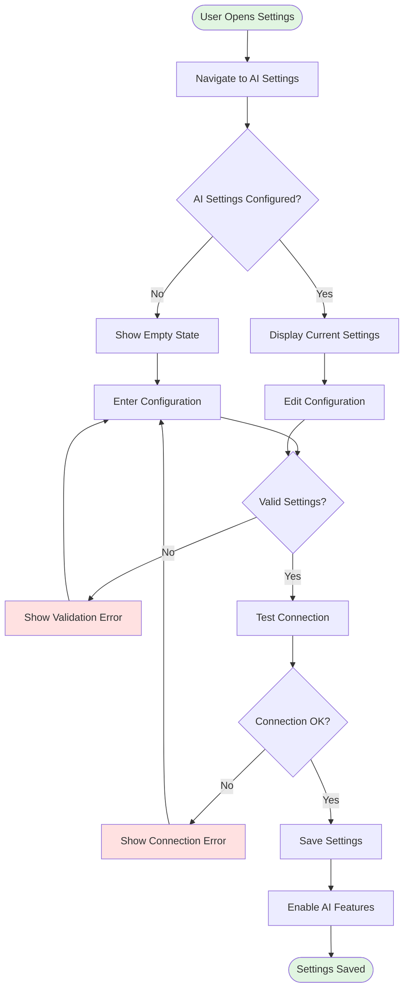
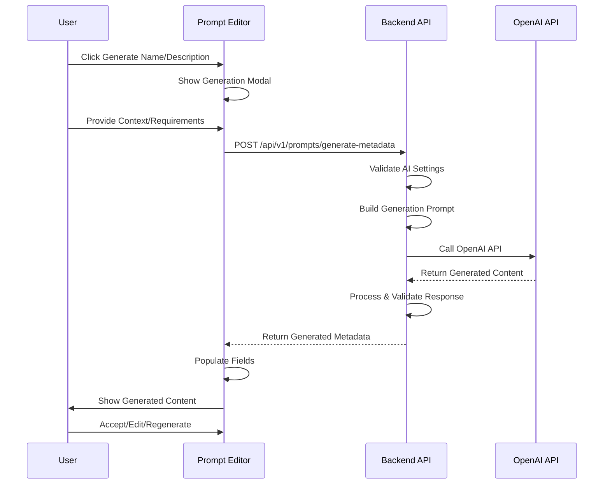
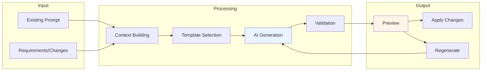
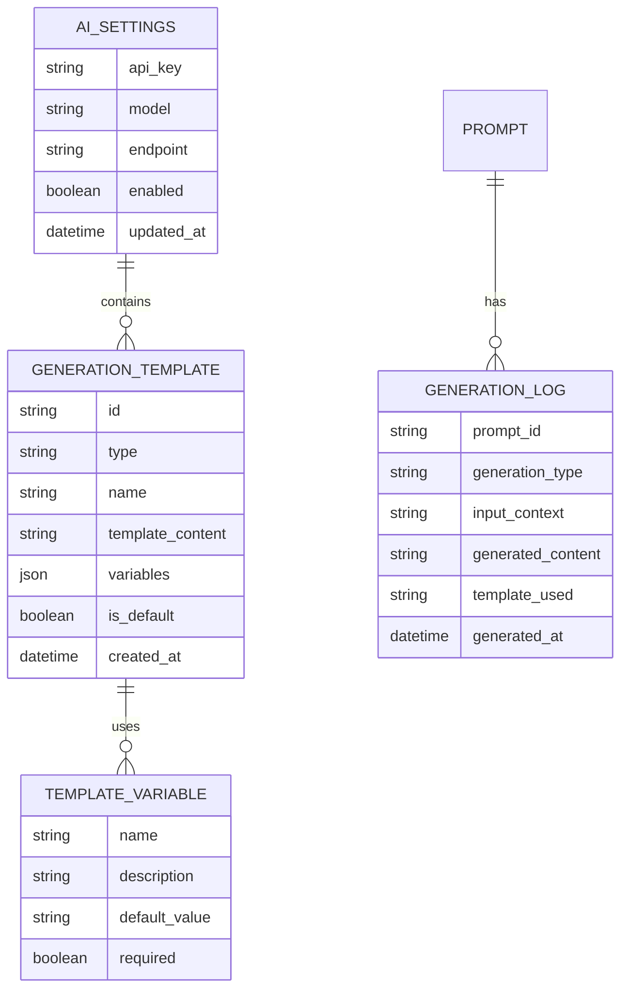
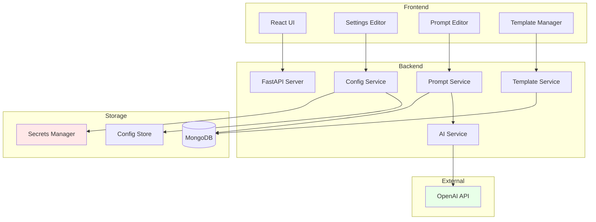
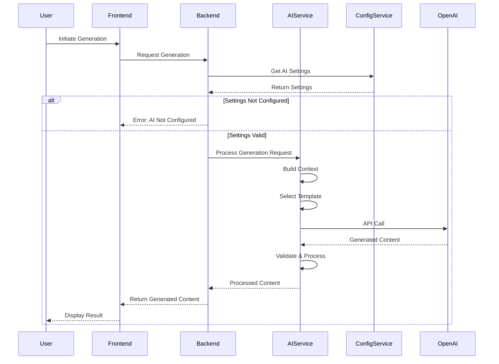

# AI-Powered Prompt Library Enhancement PRD

## Executive Summary

This PRD defines the implementation of AI-powered capabilities for the ClaudeLens prompt library, enabling users to leverage OpenAI's API to generate, refine, and optimize prompts. The feature introduces configurable AI integration settings, intelligent prompt generation, and customizable AI assistance workflows while maintaining full functionality for users who choose not to enable AI features.

## 1. Problem Statement & Solution

### Problem
Users currently must manually write and refine all prompts from scratch, which:
- Requires significant time and expertise in prompt engineering
- Leads to inconsistent prompt quality across the organization
- Creates barriers for new users unfamiliar with effective prompt patterns
- Makes iterative prompt improvement tedious and time-consuming

### Solution
Integrate OpenAI API capabilities into the prompt library to provide:
- **AI-Assisted Generation**: Generate prompt names, descriptions, and content based on user intent
- **Intelligent Refinement**: Refactor existing prompts with AI suggestions
- **Configurable Integration**: Optional AI features with customizable settings
- **Template Customization**: User-defined AI instruction templates for consistent generation

## 2. User Stories with Visual Documentation

### Epic: AI-Powered Prompt Management

#### Story 1: Configure AI Integration
**As a** system administrator
**I want** to configure OpenAI API settings
**So that** my team can leverage AI assistance in prompt creation

**Acceptance Criteria:**
- [ ] Settings page includes AI configuration section
- [ ] Can input OpenAI API key (encrypted storage)
- [ ] Can select OpenAI model (gpt-4, gpt-3.5-turbo, etc.)
- [ ] Can specify custom OpenAI endpoint (optional)
- [ ] Settings persist across sessions
- [ ] AI features only appear when properly configured



#### Story 2: Generate Prompt Metadata
**As a** prompt author
**I want** to generate prompt names and descriptions using AI
**So that** I can quickly create well-documented prompts

**Acceptance Criteria:**
- [ ] Generate button appears next to name/description fields when AI is enabled
- [ ] Generation based on existing content or user-provided context
- [ ] Loading state during generation
- [ ] Can regenerate if unsatisfied with results
- [ ] Can manually edit generated content
- [ ] Maintains field validation rules



#### Story 3: AI-Assisted Prompt Content Generation
**As a** prompt author
**I want** to generate or refactor prompt content using AI
**So that** I can create effective prompts based on my requirements

**Acceptance Criteria:**
- [ ] AI assist button in content editor when AI is enabled
- [ ] Can describe desired changes in natural language
- [ ] Supports both new generation and refinement of existing content
- [ ] Preview changes before applying
- [ ] Maintains variable syntax ({{variable}})
- [ ] Preserves formatting and structure



#### Story 4: Customize AI Generation Templates
**As a** team lead
**I want** to customize the prompts sent to OpenAI
**So that** generated content follows our organization's standards

**Acceptance Criteria:**
- [ ] Settings page includes AI template configuration
- [ ] Templates for each generation type (name, description, content)
- [ ] Support for variables in templates
- [ ] Default templates provided
- [ ] Preview template output
- [ ] Template validation



## 3. Technical Architecture

### System Architecture



### Data Flow for AI Generation



## 4. API Specifications

### New Endpoints

#### AI Configuration Endpoints

```typescript
// GET /api/v1/settings/ai
interface GetAISettingsResponse {
  enabled: boolean;
  model?: string;
  endpoint?: string;
  has_api_key: boolean; // Don't expose actual key
  templates_configured: boolean;
  models_available: string[];
}

// PUT /api/v1/settings/ai
interface UpdateAISettingsRequest {
  api_key?: string; // Only sent when updating
  model: string;
  endpoint?: string;
  enabled: boolean;
}

// POST /api/v1/settings/ai/test
interface TestAIConnectionResponse {
  success: boolean;
  message: string;
  model_info?: {
    name: string;
    max_tokens: number;
    supports_functions: boolean;
  };
}
```

#### Prompt Generation Endpoints

```typescript
// POST /api/v1/prompts/generate/metadata
interface GenerateMetadataRequest {
  context: string; // Existing content or description
  type: 'name' | 'description' | 'both';
  requirements?: string; // Additional requirements
  template_id?: string; // Custom template to use
}

interface GenerateMetadataResponse {
  name?: string;
  description?: string;
  suggestions?: string[]; // Alternative options
  generation_id: string; // For tracking
}

// POST /api/v1/prompts/generate/content
interface GenerateContentRequest {
  existing_content?: string;
  requirements: string;
  operation: 'create' | 'refactor' | 'enhance';
  preserve_variables?: boolean;
  template_id?: string;
}

interface GenerateContentResponse {
  content: string;
  variables: string[];
  changes_summary?: string; // For refactor operations
  generation_id: string;
}
```

#### Template Management Endpoints

```typescript
// GET /api/v1/settings/ai/templates
interface GetTemplatesResponse {
  templates: AITemplate[];
  defaults: {
    metadata_generation: string;
    content_generation: string;
    refactor: string;
  };
}

// PUT /api/v1/settings/ai/templates/{template_id}
interface UpdateTemplateRequest {
  name: string;
  content: string;
  variables: TemplateVariable[];
  is_active: boolean;
}

interface AITemplate {
  id: string;
  type: 'metadata' | 'content' | 'refactor';
  name: string;
  content: string;
  variables: TemplateVariable[];
  is_default: boolean;
  created_at: string;
  updated_at: string;
}

interface TemplateVariable {
  name: string;
  description: string;
  required: boolean;
  default_value?: string;
}
```

## 5. Data Models

### MongoDB Collections

```typescript
// ai_settings collection
interface AISettings {
  _id: ObjectId;
  user_id: string;
  api_key_encrypted: string; // Encrypted with app secret
  model: string;
  endpoint?: string;
  enabled: boolean;
  usage_stats: {
    total_requests: number;
    total_tokens: number;
    last_used: Date;
  };
  created_at: Date;
  updated_at: Date;
}

// generation_templates collection
interface GenerationTemplate {
  _id: ObjectId;
  type: 'metadata' | 'content' | 'refactor';
  name: string;
  description: string;
  template: string; // Jinja2 or similar template
  variables: Array<{
    name: string;
    description: string;
    required: boolean;
    default?: string;
  }>;
  is_system: boolean; // System defaults can't be deleted
  is_active: boolean;
  created_by: string;
  created_at: Date;
  updated_at: Date;
}

// generation_logs collection (for audit/analytics)
interface GenerationLog {
  _id: ObjectId;
  user_id: string;
  prompt_id?: ObjectId;
  generation_type: string;
  input_context: string;
  generated_content: string;
  template_used: ObjectId;
  model: string;
  tokens_used: number;
  duration_ms: number;
  success: boolean;
  error_message?: string;
  created_at: Date;
}
```

### Frontend State Models

```typescript
// Zustand store additions
interface AIStore {
  settings: AISettings | null;
  templates: GenerationTemplate[];
  isAIEnabled: boolean;
  isGenerating: boolean;
  generationError: string | null;

  // Actions
  loadAISettings: () => Promise<void>;
  updateAISettings: (settings: Partial<AISettings>) => Promise<void>;
  testConnection: () => Promise<boolean>;
  generateMetadata: (request: GenerateMetadataRequest) => Promise<GenerateMetadataResponse>;
  generateContent: (request: GenerateContentRequest) => Promise<GenerateContentResponse>;
  loadTemplates: () => Promise<void>;
  updateTemplate: (id: string, template: Partial<GenerationTemplate>) => Promise<void>;
}
```

## 6. UI/UX Design Specifications

### Settings Page - AI Configuration Section

```
┌─────────────────────────────────────────────────────────┐
│ Settings / AI Integration                               │
├─────────────────────────────────────────────────────────┤
│                                                         │
│ ┌─────────────────────────────────────────────────┐   │
│ │ ⚡ AI-Powered Features                           │   │
│ │                                                   │   │
│ │ Enable AI assistance for prompt generation       │   │
│ │ and refinement.                                  │   │
│ │                                                   │   │
│ │ [Toggle: OFF | ON]                              │   │
│ └─────────────────────────────────────────────────┘   │
│                                                         │
│ ┌─────────────────────────────────────────────────┐   │
│ │ OpenAI Configuration                             │   │
│ │                                                   │   │
│ │ API Key: [********************] [Show/Hide]     │   │
│ │                                                   │   │
│ │ Model:   [Dropdown: gpt-4 ▼]                    │   │
│ │          • gpt-4                                 │   │
│ │          • gpt-3.5-turbo                        │   │
│ │          • gpt-4-turbo                          │   │
│ │                                                   │   │
│ │ Endpoint: [https://api.openai.com/v1] (optional)│   │
│ │                                                   │   │
│ │ [Test Connection] [Save Settings]                │   │
│ └─────────────────────────────────────────────────┘   │
│                                                         │
│ ┌─────────────────────────────────────────────────┐   │
│ │ Generation Templates                             │   │
│ │                                                   │   │
│ │ Customize how AI generates content              │   │
│ │                                                   │   │
│ │ [Configure Templates →]                          │   │
│ └─────────────────────────────────────────────────┘   │
└─────────────────────────────────────────────────────────┘
```

### Prompt Editor - AI Integration

```
┌─────────────────────────────────────────────────────────┐
│ Edit Prompt                                        [X] │
├─────────────────────────────────────────────────────────┤
│                                                         │
│ Name: [_____________________] [✨ Generate]            │
│                                                         │
│ Description:                                            │
│ [_________________________________________]            │
│ [_________________________________________] [✨ Generate]│
│                                                         │
│ Content:                                   [✨ AI Assist]│
│ ┌─────────────────────────────────────────────────┐   │
│ │ You are a {{role}} helping with {{task}}.       │   │
│ │                                                   │   │
│ │ Consider the following context:                  │   │
│ │ {{context}}                                       │   │
│ │                                                   │   │
│ │ Please provide {{output_format}}.                │   │
│ └─────────────────────────────────────────────────┘   │
│                                                         │
│ Variables: role, task, context, output_format          │
│                                                         │
│ [Cancel]                              [Save Prompt]     │
└─────────────────────────────────────────────────────────┘
```

### AI Generation Modal

```
┌─────────────────────────────────────────────────────────┐
│ AI Content Assistant                               [X] │
├─────────────────────────────────────────────────────────┤
│                                                         │
│ What would you like to do?                             │
│                                                         │
│ ○ Create new prompt from description                   │
│ ● Refactor existing prompt                            │
│ ○ Enhance prompt effectiveness                         │
│                                                         │
│ Describe your requirements:                            │
│ ┌─────────────────────────────────────────────────┐   │
│ │ Make this prompt more concise while maintaining │   │
│ │ all the key instructions. Add better examples   │   │
│ │ for the output format.                          │   │
│ └─────────────────────────────────────────────────┘   │
│                                                         │
│ Advanced Options ▼                                     │
│ ├─ Template: [Default Refactor ▼]                     │
│ ├─ Preserve Variables: ☑                              │
│ └─ Additional Context: [___________]                   │
│                                                         │
│ [Cancel]                  [Generate] [Regenerate]      │
│                                                         │
│ ─────────────────────────────────────────────────────  │
│ Preview:                                                │
│ ┌─────────────────────────────────────────────────┐   │
│ │ [Generated content appears here after            │   │
│ │  processing...]                                   │   │
│ └─────────────────────────────────────────────────┘   │
│                                                         │
│ [Discard]                        [Apply Changes]       │
└─────────────────────────────────────────────────────────┘
```

## 7. Implementation Phases

### Phase 1: Foundation (Week 1-2)
- [ ] Create AI settings configuration UI
- [ ] Implement secure API key storage
- [ ] Add OpenAI service integration layer
- [ ] Create test connection functionality
- [ ] Update settings API endpoints

### Phase 2: Basic Generation (Week 2-3)
- [ ] Implement metadata generation (name/description)
- [ ] Add generation UI components to prompt editor
- [ ] Create generation API endpoints
- [ ] Add loading states and error handling
- [ ] Implement generation logging

### Phase 3: Content Generation (Week 3-4)
- [ ] Build AI content assistant modal
- [ ] Implement content generation/refactoring
- [ ] Add variable preservation logic
- [ ] Create preview functionality
- [ ] Add regeneration capability

### Phase 4: Template System (Week 4-5)
- [ ] Design template management UI
- [ ] Implement template CRUD operations
- [ ] Create default templates
- [ ] Add template selection in generation
- [ ] Build template testing interface

### Phase 5: Polish & Optimization (Week 5-6)
- [ ] Add usage analytics dashboard
- [ ] Implement caching for common operations
- [ ] Add rate limiting for API calls
- [ ] Create comprehensive error messages
- [ ] Add keyboard shortcuts for AI features
- [ ] Performance optimization

## 8. Risks & Mitigations

| Risk | Impact | Probability | Mitigation |
|------|--------|------------|------------|
| API Key Security Breach | High | Low | Encrypt keys at rest, use secure key management, audit access logs |
| OpenAI API Costs | Medium | Medium | Implement usage quotas, cost alerts, caching strategies |
| Generated Content Quality | Medium | Medium | Template refinement, user feedback loop, preview before apply |
| API Rate Limiting | Medium | Low | Implement retry logic, queue system, user notifications |
| Feature Adoption | Low | Medium | Progressive disclosure, tutorials, showcase benefits |
| Integration Complexity | Medium | Low | Modular design, feature flags, gradual rollout |

## 9. Success Metrics

### Primary Metrics
- **Adoption Rate**: % of users who enable AI features
- **Generation Usage**: Average generations per user per week
- **Time Saved**: Reduction in average prompt creation time
- **Quality Improvement**: User satisfaction ratings for generated content

### Secondary Metrics
- **API Cost Efficiency**: Cost per successful generation
- **Error Rate**: % of failed generation attempts
- **Template Usage**: % of generations using custom templates
- **Regeneration Rate**: Average regenerations before acceptance

### Tracking Implementation
```typescript
interface AIMetrics {
  user_metrics: {
    total_ai_users: number;
    active_ai_users_30d: number;
    adoption_rate: number;
  };
  usage_metrics: {
    total_generations: number;
    generations_by_type: Record<string, number>;
    avg_generations_per_user: number;
    peak_usage_times: string[];
  };
  performance_metrics: {
    avg_generation_time_ms: number;
    success_rate: number;
    avg_tokens_per_request: number;
    cache_hit_rate: number;
  };
  quality_metrics: {
    acceptance_rate: number;
    avg_regenerations: number;
    user_satisfaction: number;
  };
}
```

## 10. Security Considerations

### API Key Management
- Encrypt API keys using application-level encryption
- Never expose keys in frontend code or API responses
- Implement key rotation capabilities
- Audit all key access and usage

### Data Privacy
- Don't send sensitive user data to OpenAI
- Allow users to opt-out of logging
- Implement data retention policies
- Provide data export/deletion capabilities

### Rate Limiting & Abuse Prevention
```typescript
interface RateLimitConfig {
  per_user: {
    requests_per_minute: 10;
    requests_per_hour: 100;
    tokens_per_day: 50000;
  };
  global: {
    requests_per_minute: 100;
    concurrent_requests: 10;
  };
}
```

## 11. Testing Strategy

### Unit Tests
- AI service integration
- Template processing
- Variable preservation
- API key encryption/decryption

### Integration Tests
- End-to-end generation flow
- Template selection and application
- Error handling scenarios
- Rate limiting behavior

### User Acceptance Tests
- Generation quality assessment
- UI/UX flow validation
- Performance under load
- Edge case handling

## 12. Documentation Requirements

### User Documentation
- Getting started guide
- Template creation tutorial
- Best practices for prompt generation
- Troubleshooting guide

### Developer Documentation
- API reference
- Integration guide
- Security implementation details
- Performance optimization tips

## 13. Future Enhancements

### Near-term (3-6 months)
- Support for additional AI providers (Anthropic, Cohere)
- Batch generation capabilities
- Prompt testing automation
- Version comparison with AI

### Long-term (6-12 months)
- Fine-tuned models for organization-specific patterns
- Collaborative prompt refinement
- AI-powered prompt performance analytics
- Automated prompt optimization based on usage data

## Appendix A: Default Generation Templates

### Metadata Generation Template
```jinja2
Generate a concise, descriptive name and description for a prompt template based on the following:

Context: {{ context }}
Requirements: {{ requirements }}

Provide:
1. Name: A clear, action-oriented title (max 50 characters)
2. Description: A brief explanation of what the prompt does and when to use it (max 200 characters)

Format as JSON:
{
  "name": "...",
  "description": "..."
}
```

### Content Generation Template
```jinja2
Create a prompt template for the following purpose:

Requirements: {{ requirements }}

Existing content to consider: {{ existing_content }}


Guidelines:
- Use {{variable_name}} syntax for dynamic parts
- Be clear and specific in instructions
- Include examples where helpful
- Structure for readability

Generate the prompt content only, no explanations.
```

### Refactoring Template
```jinja2
Refactor the following prompt template:

Current prompt: {{ existing_content }}

Requested changes: {{ requirements }}

Constraints:

- Maintain all existing variables ({{variable}})

- Keep the core purpose intact
- Improve clarity and effectiveness

Provide the refactored prompt only.
```

## Appendix B: Error Messages and User Feedback

| Scenario | Error Message | User Action |
|----------|--------------|-------------|
| API Key Invalid | "Invalid OpenAI API key. Please check your settings." | Update API key in settings |
| Rate Limit Exceeded | "Generation limit reached. Please try again in X minutes." | Wait or upgrade plan |
| Generation Failed | "Unable to generate content. Please try again or modify your request." | Retry or adjust input |
| Network Error | "Connection to AI service failed. Please check your internet connection." | Check connection, retry |
| Insufficient Context | "Please provide more details about what you want to generate." | Add more description |

---

**Document Status**: Ready for Implementation
**Version**: 1.0
**Last Updated**: 2024-01-20
**Author**: ClaudeLens Development Team
