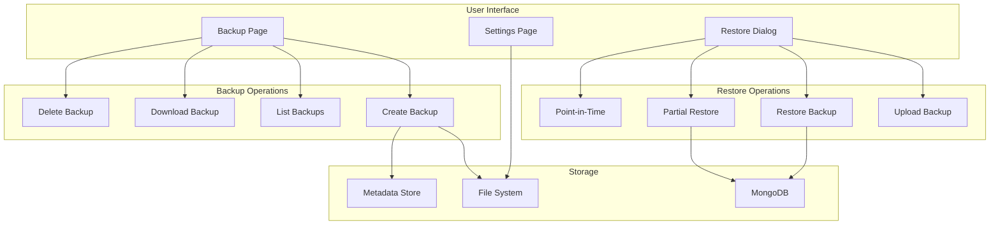
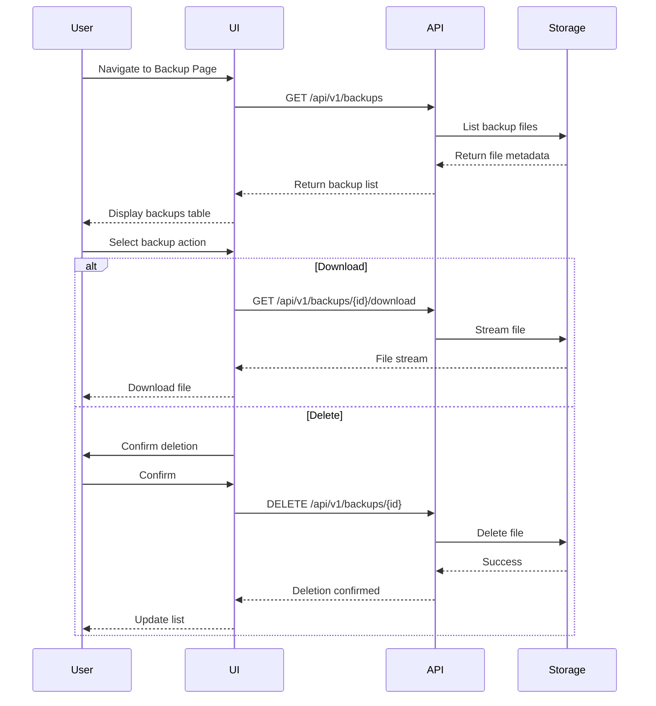
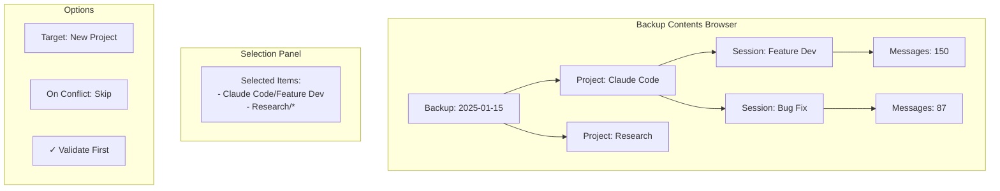
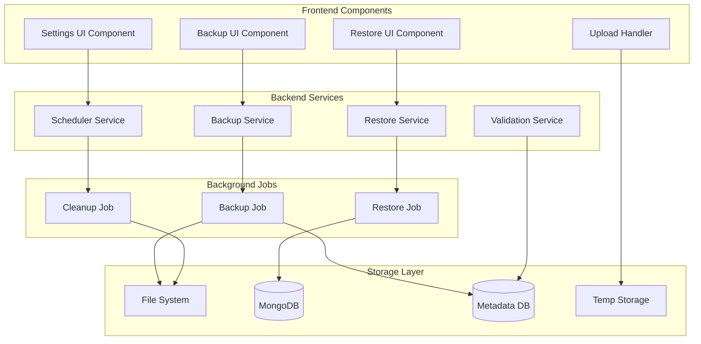
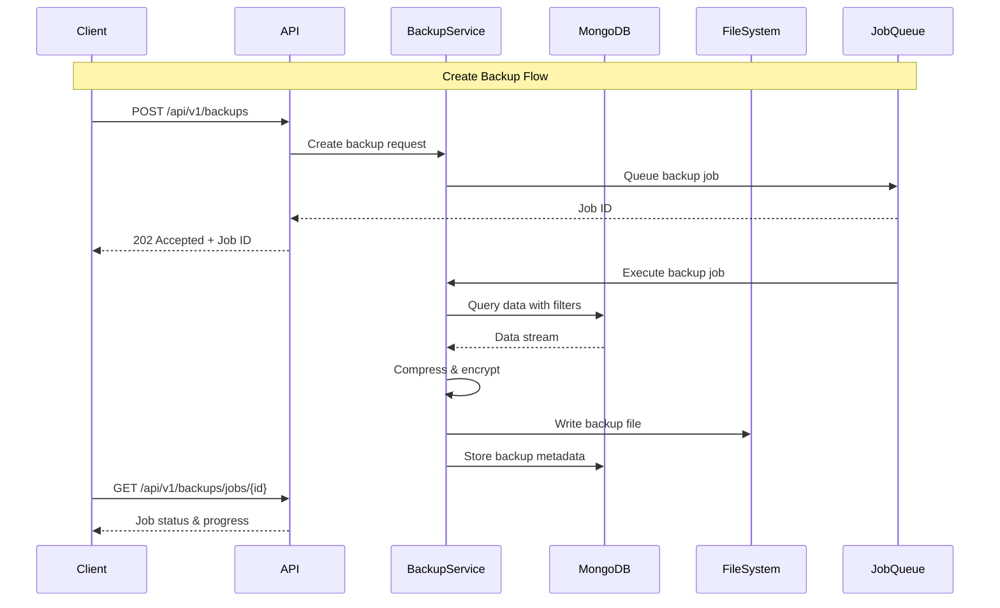

# Backup and Restore Feature - Product Requirements Document

## Executive Summary

This PRD outlines the implementation of a comprehensive backup and restore system for ClaudeLens, enabling users to protect their conversation data, manage backups efficiently, and perform granular restorations. The feature addresses critical data protection needs while providing flexibility through selective backup/restore capabilities and automated scheduling options.

### Key Capabilities
- Create full and selective backups with advanced filtering
- Server-side backup storage with configurable directory
- Download/upload backup files for external storage
- Granular restore options with preview capabilities
- Automated backup scheduling
- Point-in-time recovery support

## Problem Statement

### Current Challenges
1. **Data Loss Risk**: Users have no way to protect their conversation history from accidental deletion, corruption, or system failures
2. **Migration Difficulties**: No mechanism to transfer data between environments or instances
3. **Compliance Requirements**: Organizations need data retention and recovery capabilities for regulatory compliance
4. **Testing Limitations**: Developers cannot safely experiment with data without risk
5. **Disaster Recovery**: No recovery plan for catastrophic failures

### Target Users
- **System Administrators**: Need reliable backup/restore for production data
- **Power Users**: Want to protect valuable conversation history
- **Organizations**: Require compliance with data retention policies
- **Developers**: Need safe data snapshots for testing

## Solution Overview

### Core Functionality



## User Stories

### Epic 1: Backup Management

#### Story 1.1: Create Backup with Filters
**As a** system administrator
**I want** to create backups with specific filters
**So that** I can backup only relevant data and optimize storage

**Acceptance Criteria:**
- [ ] Can select specific projects to include/exclude
- [ ] Can filter by date range
- [ ] Can choose backup type (full, incremental, selective)
- [ ] Shows estimated backup size before creation
- [ ] Displays progress indicator during backup
- [ ] Generates unique backup identifier
- [ ] Records backup metadata (timestamp, size, filters used)

**Technical Notes:**
- Use MongoDB aggregation pipeline for filtering
- Implement streaming for large datasets
- Compress backup files using gzip
- Generate checksums for integrity verification

#### Story 1.2: List and Manage Backups
**As a** user
**I want** to view and manage all server-stored backups
**So that** I can track backup history and manage storage

**Acceptance Criteria:**
- [ ] Display backup list with metadata (name, date, size, type)
- [ ] Sort by date, size, or name
- [ ] Filter backups by type or date range
- [ ] Show backup status (complete, partial, corrupted)
- [ ] Display storage usage statistics
- [ ] Bulk selection for operations

**User Flow:**


### Epic 2: Restore Operations

#### Story 2.1: Full Restore from Server
**As a** administrator
**I want** to restore a complete backup from server storage
**So that** I can recover from data loss quickly

**Acceptance Criteria:**
- [ ] Preview backup contents before restore
- [ ] Choose restore mode (overwrite, merge, new project)
- [ ] Show conflict resolution options
- [ ] Display restore progress
- [ ] Validate backup integrity before restore
- [ ] Provide rollback option within 24 hours
- [ ] Generate restore report

#### Story 2.2: Selective/Partial Restore
**As a** power user
**I want** to selectively restore specific data from a backup
**So that** I can recover only what's needed without affecting other data

**Acceptance Criteria:**
- [ ] Browse backup contents hierarchically
- [ ] Select specific projects, sessions, or messages
- [ ] Preview selected items before restore
- [ ] Choose target location for restored data
- [ ] Handle duplicate detection
- [ ] Map old IDs to new IDs to maintain relationships

**Selective Restore Interface:**


#### Story 2.3: Upload and Restore External Backup
**As a** user migrating data
**I want** to upload and restore a backup file
**So that** I can migrate data between instances

**Acceptance Criteria:**
- [ ] Support drag-and-drop file upload
- [ ] Validate file format and version compatibility
- [ ] Show upload progress for large files
- [ ] Verify backup integrity (checksum)
- [ ] Preview contents before restore
- [ ] Handle version migrations if needed

### Epic 3: Configuration and Automation

#### Story 3.1: Configure Backup Settings
**As a** system administrator
**I want** to configure backup storage settings
**So that** I can manage where and how backups are stored

**Acceptance Criteria:**
- [ ] Configure backup directory path
- [ ] Set retention policies (days, count)
- [ ] Configure automatic cleanup rules
- [ ] Set storage quota limits
- [ ] Configure compression settings
- [ ] Enable/disable backup encryption

#### Story 3.2: Automated Backup Scheduling
**As a** administrator
**I want** to schedule automatic backups
**So that** data is protected without manual intervention

**Acceptance Criteria:**
- [ ] Configure backup schedule (daily, weekly, monthly)
- [ ] Set backup time window
- [ ] Configure backup filters for scheduled backups
- [ ] Set up email notifications for backup status
- [ ] View scheduled backup history
- [ ] Pause/resume scheduled backups

## Technical Architecture

### System Components



### Data Flow Architecture



## Data Models

### Backup Metadata Schema

```typescript
interface BackupMetadata {
  _id: string;
  filename: string;
  filepath: string;
  created_at: Date;
  created_by: string;
  size_bytes: number;
  compressed_size_bytes: number;
  type: 'full' | 'incremental' | 'selective';
  status: 'pending' | 'in_progress' | 'completed' | 'failed' | 'corrupted';
  filters: {
    projects?: string[];
    date_range?: {
      start: Date;
      end: Date;
    };
    include_patterns?: string[];
    exclude_patterns?: string[];
  };
  contents: {
    projects_count: number;
    sessions_count: number;
    messages_count: number;
    prompts_count: number;
    total_documents: number;
  };
  encryption: {
    enabled: boolean;
    algorithm?: string;
    key_id?: string;
  };
  checksum: string;
  version: string;
  restore_points?: RestorePoint[];
}

interface RestorePoint {
  _id: string;
  timestamp: Date;
  description: string;
  restored_by?: string;
  restored_at?: Date;
  status: 'available' | 'restored' | 'failed';
}
```

### Backup File Format

```json
{
  "version": "1.0.0",
  "metadata": {
    "created_at": "2025-01-15T10:30:00Z",
    "source_instance": "claudelens-prod",
    "backup_type": "selective",
    "checksum": "sha256:..."
  },
  "data": {
    "projects": [...],
    "sessions": [...],
    "messages": [...],
    "prompts": [...],
    "ai_settings": [...],
    "generation_templates": [...]
  },
  "relationships": {
    "session_projects": {...},
    "message_sessions": {...},
    "prompt_projects": {...}
  }
}
```

## API Specifications

### Backup Endpoints

#### POST /api/v1/backups
Create a new backup

**Request:**
```json
{
  "name": "Daily Backup 2025-01-15",
  "type": "selective",
  "filters": {
    "projects": ["project-1", "project-2"],
    "date_range": {
      "start": "2025-01-01T00:00:00Z",
      "end": "2025-01-15T23:59:59Z"
    }
  },
  "options": {
    "compress": true,
    "encrypt": true,
    "include_metadata": true
  }
}
```

**Response:**
```json
{
  "job_id": "job-123",
  "status": "pending",
  "estimated_size_bytes": 524288000,
  "estimated_duration_seconds": 120
}
```

#### GET /api/v1/backups
List all backups

**Query Parameters:**
- `page`: Page number (default: 1)
- `limit`: Items per page (default: 20)
- `sort`: Sort field (created_at, size, name)
- `order`: Sort order (asc, desc)
- `type`: Filter by backup type
- `status`: Filter by status

**Response:**
```json
{
  "items": [
    {
      "_id": "backup-123",
      "filename": "backup-2025-01-15-103000.tar.gz",
      "created_at": "2025-01-15T10:30:00Z",
      "size_bytes": 524288000,
      "type": "full",
      "status": "completed",
      "contents": {
        "projects_count": 5,
        "sessions_count": 150,
        "messages_count": 3500
      }
    }
  ],
  "total": 42,
  "page": 1,
  "pages": 3
}
```

#### GET /api/v1/backups/{id}/download
Download a backup file

**Response:** Binary stream with appropriate headers
```
Content-Type: application/gzip
Content-Disposition: attachment; filename="backup-2025-01-15.tar.gz"
Content-Length: 524288000
```

#### DELETE /api/v1/backups/{id}
Delete a backup

**Response:**
```json
{
  "message": "Backup deleted successfully",
  "freed_bytes": 524288000
}
```

### Restore Endpoints

#### POST /api/v1/restore
Initiate a restore operation

**Request:**
```json
{
  "backup_id": "backup-123",
  "mode": "selective",
  "options": {
    "overwrite": false,
    "create_new_project": true,
    "project_name_suffix": "_restored"
  },
  "selections": {
    "projects": ["project-1"],
    "sessions": ["session-45", "session-67"],
    "date_range": {
      "start": "2025-01-10T00:00:00Z",
      "end": "2025-01-12T23:59:59Z"
    }
  }
}
```

**Response:**
```json
{
  "job_id": "restore-job-456",
  "status": "pending",
  "estimated_documents": 1500,
  "validation_warnings": []
}
```

#### POST /api/v1/restore/upload
Upload and restore an external backup

**Request:** Multipart form data
```
Content-Type: multipart/form-data
- file: backup file
- options: JSON restore options
```

**Response:**
```json
{
  "upload_id": "upload-789",
  "status": "validating",
  "file_size": 524288000,
  "detected_version": "1.0.0",
  "compatibility": "compatible"
}
```

#### GET /api/v1/restore/preview/{backup_id}
Preview backup contents before restore

**Response:**
```json
{
  "backup_id": "backup-123",
  "created_at": "2025-01-15T10:30:00Z",
  "contents": {
    "projects": [
      {
        "_id": "project-1",
        "name": "Claude Code Project",
        "sessions_count": 45,
        "messages_count": 890
      }
    ],
    "summary": {
      "total_projects": 5,
      "total_sessions": 150,
      "total_messages": 3500,
      "date_range": {
        "earliest": "2024-12-01T00:00:00Z",
        "latest": "2025-01-15T23:59:59Z"
      }
    }
  },
  "restore_options": {
    "can_merge": true,
    "can_overwrite": true,
    "has_conflicts": false
  }
}
```

### Settings Endpoints

#### GET /api/v1/settings/backup
Get backup configuration

**Response:**
```json
{
  "backup_directory": "/var/claudelens/backups",
  "retention_days": 30,
  "max_backups": 50,
  "auto_cleanup": true,
  "compression": {
    "enabled": true,
    "level": 6
  },
  "encryption": {
    "enabled": false
  },
  "scheduling": {
    "enabled": true,
    "schedule": "0 2 * * *",
    "type": "full",
    "filters": {}
  }
}
```

#### PUT /api/v1/settings/backup
Update backup configuration

**Request:**
```json
{
  "backup_directory": "/mnt/backups/claudelens",
  "retention_days": 60,
  "scheduling": {
    "enabled": true,
    "schedule": "0 3 * * *"
  }
}
```

## Frontend Implementation

### Backup Page Component Structure

```typescript
// src/pages/Backup.tsx
interface BackupPageState {
  backups: BackupMetadata[];
  loading: boolean;
  selectedBackups: string[];
  createBackupDialog: {
    open: boolean;
    filters: BackupFilters;
  };
  restoreDialog: {
    open: boolean;
    backup?: BackupMetadata;
    mode: 'full' | 'selective';
    selections: RestoreSelections;
  };
  uploadDialog: {
    open: boolean;
    file?: File;
    uploadProgress: number;
  };
}

// Component hierarchy
<BackupPage>
  <BackupToolbar>
    <CreateBackupButton />
    <UploadBackupButton />
    <AutoBackupToggle />
  </BackupToolbar>

  <BackupList>
    <BackupTable>
      <BackupRow>
        <BackupActions>
          <DownloadButton />
          <RestoreButton />
          <DeleteButton />
        </BackupActions>
      </BackupRow>
    </BackupTable>
  </BackupList>

  <CreateBackupDialog>
    <BackupFilters />
    <BackupOptions />
    <SizeEstimator />
  </CreateBackupDialog>

  <RestoreDialog>
    <RestoreMode />
    <SelectiveRestoreTree />
    <ConflictResolver />
    <RestoreProgress />
  </RestoreDialog>

  <UploadDialog>
    <FileDropzone />
    <UploadProgress />
    <ValidationResults />
  </UploadDialog>
</BackupPage>
```

### Settings Integration

```typescript
// src/pages/Settings.tsx - Backup Configuration Section
<SettingsSection title="Backup Configuration">
  <DirectoryPicker
    label="Backup Directory"
    value={settings.backup_directory}
    onChange={updateBackupDirectory}
  />

  <NumberInput
    label="Retention Days"
    value={settings.retention_days}
    min={1}
    max={365}
    onChange={updateRetentionDays}
  />

  <ScheduleConfig
    enabled={settings.scheduling.enabled}
    schedule={settings.scheduling.schedule}
    onChange={updateSchedule}
  />

  <CompressionSettings
    enabled={settings.compression.enabled}
    level={settings.compression.level}
    onChange={updateCompression}
  />
</SettingsSection>
```

## Implementation Phases

### Phase 1: Core Backup & Restore (MVP)
**Priority: P0**
- Basic backup creation (full backup only)
- List and download backups
- Simple full restore from server
- Delete backup functionality
- Backend storage configuration

**Deliverables:**
- Backup API endpoints
- Basic backup page UI
- File system storage implementation
- Backup metadata tracking

### Phase 2: Selective Operations
**Priority: P1**
- Filtered backup creation
- Selective/partial restore
- Backup content preview
- Upload external backup
- Conflict detection

**Deliverables:**
- Advanced filter UI
- Selective restore tree component
- Validation service
- Content browser

### Phase 3: Automation & Management
**Priority: P2**
- Scheduled backups
- Retention policies
- Automatic cleanup
- Storage quota management
- Email notifications

**Deliverables:**
- Scheduler service
- Background job system
- Notification service
- Storage monitoring

### Phase 4: Advanced Features
**Priority: P3**
- Incremental backups
- Point-in-time recovery
- Backup encryption
- Cross-instance migration tools
- Backup integrity monitoring

**Deliverables:**
- Encryption service
- Migration utilities
- Health monitoring dashboard

## Risk Analysis

### Technical Risks

| Risk | Impact | Probability | Mitigation |
|------|--------|-------------|------------|
| Large backup files consuming storage | High | High | Implement compression, quotas, and cleanup policies |
| Backup corruption | High | Low | Checksum validation, multiple backup retention |
| Restore failures | High | Medium | Preview and validation before restore, rollback capability |
| Performance impact during backup | Medium | Medium | Background processing, streaming, off-peak scheduling |
| Version incompatibility | Medium | Low | Version tracking, migration scripts |

### Security Risks

| Risk | Impact | Probability | Mitigation |
|------|--------|-------------|------------|
| Unauthorized access to backups | High | Medium | Authentication, file permissions, optional encryption |
| Data leakage through downloads | High | Low | Audit logging, access controls |
| Backup tampering | Medium | Low | Checksum verification, read-only storage |

## Success Metrics

### Quantitative Metrics
- **Backup Success Rate**: >99% of scheduled backups complete successfully
- **Restore Success Rate**: >99.5% of restore operations complete without errors
- **Performance**: Backup speed >50MB/s for local storage
- **Storage Efficiency**: 60%+ compression ratio average
- **Recovery Time**: <5 minutes for 1GB restore

### Qualitative Metrics
- **User Satisfaction**: 90%+ positive feedback on backup reliability
- **Ease of Use**: <3 clicks to create a basic backup
- **Feature Adoption**: 50%+ of active users utilize backup feature
- **Support Tickets**: <5% of tickets related to backup/restore issues

### Business Metrics
- **Data Loss Prevention**: Zero reported data loss incidents
- **Compliance**: 100% adherence to retention policies
- **Migration Success**: 95%+ successful cross-instance migrations
- **Cost Efficiency**: <$0.10 per GB of backup storage

## Dependencies

### Technical Dependencies
- MongoDB 7.0+ for metadata storage
- File system with sufficient IOPS for streaming
- Background job processing system
- Compression library (gzip/brotli)
- Optional: Encryption library (AES-256)

### External Dependencies
- Storage infrastructure provisioning
- Network bandwidth for large file transfers
- Email service for notifications (Phase 3)

## Testing Strategy

### Unit Testing
- Backup filter logic
- Compression/decompression
- Checksum calculation
- Restore conflict detection
- File streaming handlers

### Integration Testing
- End-to-end backup creation
- Restore with data validation
- Upload and validation flow
- Scheduled backup execution
- Storage quota enforcement

### Performance Testing
- Large backup creation (>10GB)
- Concurrent backup operations
- Restore under load
- Stream handling efficiency

### Security Testing
- Access control validation
- Encryption/decryption if enabled
- File permission verification
- SQL injection prevention

## Documentation Requirements

### User Documentation
- Backup creation guide
- Restore procedures
- Troubleshooting guide
- Best practices document
- Video tutorials

### Technical Documentation
- API reference
- Database schema
- File format specification
- Migration guides
- Disaster recovery procedures

## Appendices

### A. Backup File Format Specification
Detailed specification of the backup file format, including:
- Header structure
- Data serialization format
- Compression algorithm details
- Checksum calculation method
- Version migration paths

### B. Recovery Scenarios
Common recovery scenarios and procedures:
- Accidental deletion recovery
- Corruption recovery
- Point-in-time recovery
- Cross-instance migration
- Disaster recovery

### C. Performance Benchmarks
Expected performance metrics:
- Backup creation speed by data size
- Restore speed by operation type
- Compression ratios by data type
- Storage requirements calculator

### D. Compliance Considerations
- GDPR data portability requirements
- HIPAA backup encryption requirements
- SOC 2 backup testing requirements
- Industry-specific retention policies

---

## Implementation Checklist

### Backend Tasks
- [ ] Create backup service module
- [ ] Implement file storage manager
- [ ] Create restore service module
- [ ] Add validation service
- [ ] Implement job queue system
- [ ] Create scheduler service
- [ ] Add backup metadata models
- [ ] Implement API endpoints
- [ ] Add authentication/authorization
- [ ] Create migration scripts

### Frontend Tasks
- [ ] Create Backup page component
- [ ] Implement backup list table
- [ ] Create backup dialog
- [ ] Build restore dialog
- [ ] Add upload component
- [ ] Create selective restore tree
- [ ] Add progress indicators
- [ ] Implement settings section
- [ ] Add confirmation dialogs
- [ ] Create help documentation

### Infrastructure Tasks
- [ ] Provision backup storage
- [ ] Configure file permissions
- [ ] Set up monitoring
- [ ] Configure backup alerts
- [ ] Create deployment scripts
- [ ] Set up test environments

### Quality Assurance
- [ ] Write unit tests
- [ ] Create integration tests
- [ ] Perform security audit
- [ ] Load testing
- [ ] User acceptance testing
- [ ] Documentation review

---

**Document Version**: 1.0.0
**Last Updated**: January 2025
**Status**: Ready for Implementation
**Author**: ClaudeLens Team
**Review Status**: Pending Technical Review
