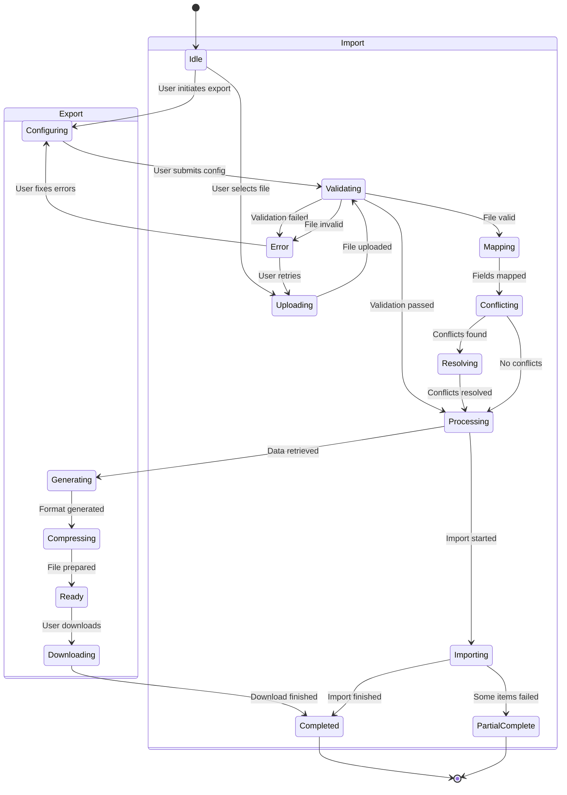

# Import/Export Feature - Product Requirements Document

## Executive Summary

The ClaudeLens Import/Export feature provides users with comprehensive data portability, enabling them to export conversation history for backup, analysis, and migration purposes, while also allowing seamless import of previously exported data or compatible formats. This feature addresses critical user needs for data ownership, compliance requirements, and system interoperability.

**Key Capabilities:**
- Multi-format export support (JSON, CSV, Markdown, PDF)
- Intelligent conflict resolution during imports
- GDPR-compliant data handling with privacy controls
- Batch processing for large datasets
- Real-time progress tracking and validation

## Problem & Solution

### Problem Statement

Users currently lack the ability to:
1. **Data Portability**: Export their conversation data for backup or migration to other systems
2. **Bulk Operations**: Import historical conversations from other platforms or previous exports
3. **Compliance**: Meet data retention and portability requirements under GDPR and other regulations
4. **Analysis**: Export data for external analysis in spreadsheet or BI tools
5. **Archival**: Create print-ready or human-readable archives of important conversations

### Solution Overview

A comprehensive import/export system that:
- Provides flexible export options with multiple format support
- Implements intelligent import with field mapping and conflict resolution
- Ensures data privacy and security throughout the process
- Offers real-time progress tracking and validation
- Maintains data integrity with rollback capabilities

## User Stories

### Epic: Data Export Functionality

#### Story 1: Export Conversations in Multiple Formats
**As a** power user
**I want** to export my conversations in different formats
**So that** I can use the data in various external tools and contexts

**Acceptance Criteria:**
- [ ] Support JSON format with complete metadata preservation
- [ ] Support CSV format for spreadsheet analysis
- [ ] Support Markdown format for human-readable documentation
- [ ] Support PDF format for print-ready archives
- [ ] Allow format-specific options (compression, splitting, etc.)
- [ ] Provide real-time file size estimation

**Technical Notes:**
- Implement streaming for large exports to prevent memory issues
- Use worker threads for PDF generation
- Support incremental exports for performance

#### Story 2: Selective Export with Filtering
**As a** project manager
**I want** to export specific subsets of conversations
**So that** I can share relevant data with stakeholders

**Acceptance Criteria:**
- [ ] Filter by date range
- [ ] Filter by project/workspace
- [ ] Filter by conversation participants
- [ ] Filter by tags and labels
- [ ] Filter by cost range
- [ ] Support complex filter combinations
- [ ] Preview filtered results before export

#### Story 3: Export with Privacy Controls
**As a** compliance officer
**I want** to export data with privacy controls
**So that** I can meet regulatory requirements

**Acceptance Criteria:**
- [ ] Option to redact personal information
- [ ] Automatic removal of API keys and tokens
- [ ] User message anonymization option
- [ ] Encryption with user-provided password
- [ ] Audit trail of all exports
- [ ] Configurable data retention policies

### Epic: Data Import Functionality

#### Story 4: Import Previously Exported Data
**As a** returning user
**I want** to import my previously exported conversations
**So that** I can restore my data after migration or deletion

**Acceptance Criteria:**
- [ ] Support all export formats (JSON, CSV, Markdown)
- [ ] Validate file format and structure
- [ ] Provide field mapping interface
- [ ] Preview import before execution
- [ ] Handle large files efficiently
- [ ] Support batch imports

#### Story 5: Intelligent Conflict Resolution
**As a** user with existing data
**I want** the system to handle duplicate conversations intelligently
**So that** I don't lose or duplicate important information

**Acceptance Criteria:**
- [ ] Detect duplicate conversations by ID or content
- [ ] Offer multiple resolution strategies (skip, replace, merge)
- [ ] Apply bulk resolution options
- [ ] Preview conflict resolution results
- [ ] Maintain data integrity during merge operations
- [ ] Create backup before destructive operations

#### Story 6: Import Progress and Validation
**As a** user importing large datasets
**I want** to see detailed progress and validation results
**So that** I can monitor the import and address any issues

**Acceptance Criteria:**
- [ ] Real-time progress indicators
- [ ] Detailed validation messages
- [ ] Error recovery and retry mechanisms
- [ ] Partial import capabilities
- [ ] Import summary and statistics
- [ ] Rollback capability for failed imports

## Technical Architecture

### System Components


### Data Flow - Export Process


### Data Flow - Import Process


### State Management



## API Specifications

### Export Endpoints

#### 1. Create Export Job
```http
POST /api/v1/export

Request:
{
  "format": "json" | "csv" | "markdown" | "pdf",
  "filters": {
    "date_range": {
      "start": "2024-01-01T00:00:00Z",
      "end": "2024-01-31T23:59:59Z"
    },
    "project_ids": ["proj_123", "proj_456"],
    "session_ids": ["sess_789"],
    "tags": ["react", "optimization"],
    "model": "claude-3-opus",
    "cost_range": {
      "min": 0,
      "max": 100
    },
    "message_types": ["user", "assistant", "tool_use"]
  },
  "options": {
    "include_messages": true,
    "include_metadata": true,
    "include_tool_calls": true,
    "compress": true,
    "split_size_mb": 50,
    "encryption": {
      "enabled": true,
      "password": "user_provided_password"
    },
    "privacy": {
      "redact_pii": false,
      "anonymize_users": false,
      "remove_api_keys": true
    }
  }
}

Response (200 OK):
{
  "job_id": "export_abc123",
  "status": "queued",
  "estimated_size_bytes": 25600000,
  "estimated_duration_seconds": 45,
  "created_at": "2024-01-31T14:23:00Z",
  "expires_at": "2024-03-01T14:23:00Z"
}
```

#### 2. Get Export Status
```http
GET /api/v1/export/{job_id}/status

Response (200 OK):
{
  "job_id": "export_abc123",
  "status": "processing" | "completed" | "failed",
  "progress": {
    "current": 1500,
    "total": 3842,
    "percentage": 39
  },
  "current_item": "Processing conversation: React Component Optimization",
  "file_info": {
    "format": "json",
    "size_bytes": 25600000,
    "conversations_count": 156,
    "messages_count": 3842
  },
  "errors": [],
  "created_at": "2024-01-31T14:23:00Z",
  "completed_at": null
}
```

#### 3. Download Export
```http
GET /api/v1/export/{job_id}/download

Response (200 OK):
Content-Type: application/octet-stream
Content-Disposition: attachment; filename="claudelens_export_20240131.json"
Content-Length: 25600000

[Binary file data]
```

#### 4. Cancel Export
```http
DELETE /api/v1/export/{job_id}

Response (200 OK):
{
  "job_id": "export_abc123",
  "status": "cancelled",
  "message": "Export job cancelled successfully"
}
```

### Import Endpoints

#### 1. Validate Import File
```http
POST /api/v1/import/validate
Content-Type: multipart/form-data

Request:
{
  "file": <binary>,
  "options": {
    "dry_run": true
  }
}

Response (200 OK):
{
  "valid": true,
  "format": "json",
  "file_info": {
    "size_bytes": 12400000,
    "conversations_count": 89,
    "messages_count": 2341,
    "date_range": {
      "start": "2024-01-01T00:00:00Z",
      "end": "2024-01-31T23:59:59Z"
    }
  },
  "field_mapping": {
    "detected_fields": ["id", "title", "messages", "created_at"],
    "mapping_suggestions": {
      "id": "session_id",
      "title": "session_title",
      "messages": "messages",
      "created_at": "created_at"
    }
  },
  "validation_warnings": [],
  "validation_errors": []
}
```

#### 2. Check Import Conflicts
```http
POST /api/v1/import/conflicts

Request:
{
  "file_id": "upload_xyz789",
  "field_mapping": {
    "id": "session_id",
    "title": "session_title"
  }
}

Response (200 OK):
{
  "conflicts_count": 12,
  "conflicts": [
    {
      "existing_id": "sess_123",
      "import_id": "conv_abc123",
      "title": "React Component Optimization",
      "existing_data": {
        "messages_count": 42,
        "last_updated": "2024-01-10T12:00:00Z",
        "cost_usd": 2.45
      },
      "import_data": {
        "messages_count": 48,
        "last_updated": "2024-01-15T14:00:00Z",
        "cost_usd": 2.89
      },
      "suggested_action": "merge"
    }
  ]
}
```

#### 3. Execute Import
```http
POST /api/v1/import/execute

Request:
{
  "file_id": "upload_xyz789",
  "field_mapping": {
    "id": "session_id",
    "title": "session_title",
    "messages": "messages",
    "created_at": "created_at"
  },
  "conflict_resolution": {
    "default_strategy": "merge",
    "specific_resolutions": {
      "sess_123": "replace",
      "sess_456": "skip"
    }
  },
  "options": {
    "create_backup": true,
    "validate_references": true,
    "calculate_costs": true
  }
}

Response (200 OK):
{
  "job_id": "import_def456",
  "status": "processing",
  "estimated_duration_seconds": 120
}
```

#### 4. Get Import Progress
```http
GET /api/v1/import/{job_id}/progress

Response (200 OK):
{
  "job_id": "import_def456",
  "status": "processing",
  "progress": {
    "processed": 45,
    "total": 89,
    "percentage": 50.5,
    "current_item": "API Design Discussion"
  },
  "statistics": {
    "imported": 40,
    "skipped": 3,
    "failed": 2,
    "merged": 15,
    "replaced": 25
  },
  "errors": [
    {
      "item_id": "conv_xyz789",
      "error": "Invalid message format",
      "details": "Message missing required 'content' field"
    }
  ]
}
```

### WebSocket Events

#### Export Progress
```javascript
// Client subscribes to export progress
ws.send({
  type: "subscribe",
  channel: "export",
  job_id: "export_abc123"
});

// Server sends progress updates
{
  type: "export_progress",
  job_id: "export_abc123",
  progress: {
    current: 1500,
    total: 3842,
    percentage: 39,
    current_item: "Processing: React Component Optimization"
  }
}

// Server sends completion
{
  type: "export_complete",
  job_id: "export_abc123",
  download_url: "/api/v1/export/export_abc123/download",
  expires_at: "2024-03-01T14:23:00Z"
}
```

#### Import Progress
```javascript
// Client subscribes to import progress
ws.send({
  type: "subscribe",
  channel: "import",
  job_id: "import_def456"
});

// Server sends progress updates
{
  type: "import_progress",
  job_id: "import_def456",
  progress: {
    current: 45,
    total: 89,
    percentage: 50.5,
    current_item: "Importing: API Design Discussion"
  },
  statistics: {
    imported: 40,
    skipped: 3,
    failed: 2
  }
}
```

## Data Models

### Export Job Model
```typescript
interface ExportJob {
  id: string;
  user_id: string;
  status: 'queued' | 'processing' | 'completed' | 'failed' | 'cancelled';
  format: 'json' | 'csv' | 'markdown' | 'pdf';
  filters: ExportFilters;
  options: ExportOptions;
  progress: {
    current: number;
    total: number;
    percentage: number;
    current_item?: string;
  };
  file_info?: {
    path: string;
    size_bytes: number;
    checksum: string;
    encrypted: boolean;
  };
  statistics: {
    conversations_count: number;
    messages_count: number;
    total_cost_usd: number;
    date_range: DateRange;
  };
  errors: ExportError[];
  created_at: Date;
  started_at?: Date;
  completed_at?: Date;
  expires_at: Date;
}
```

### Import Job Model
```typescript
interface ImportJob {
  id: string;
  user_id: string;
  status: 'validating' | 'mapping' | 'processing' | 'completed' | 'failed' | 'partial';
  file_info: {
    original_name: string;
    format: string;
    size_bytes: number;
    upload_path: string;
  };
  field_mapping: FieldMapping;
  conflict_resolution: ConflictResolution;
  progress: {
    current: number;
    total: number;
    percentage: number;
    current_item?: string;
  };
  statistics: {
    total_items: number;
    imported: number;
    skipped: number;
    failed: number;
    merged: number;
    replaced: number;
  };
  validation_results: ValidationResult[];
  errors: ImportError[];
  backup_id?: string;
  created_at: Date;
  started_at?: Date;
  completed_at?: Date;
}
```

### Conversation Export Format
```typescript
interface ExportedConversation {
  id: string;
  external_id?: string;
  title: string;
  summary?: string;
  project_id?: string;
  project_name?: string;
  created_at: string;
  updated_at: string;
  duration_seconds?: number;
  model: string;
  cost_usd: number;
  message_count: number;
  tags: string[];
  metadata: {
    browser?: string;
    platform?: string;
    user_agent?: string;
    custom_fields: Record<string, any>;
  };
  messages: ExportedMessage[];
  branches?: ConversationBranch[];
  parent_conversation_id?: string;
}
```

### Message Export Format
```typescript
interface ExportedMessage {
  id: string;
  type: 'user' | 'assistant' | 'system' | 'tool_use' | 'tool_result';
  content: string;
  timestamp: string;
  tokens?: {
    input: number;
    output: number;
  };
  cost_usd?: number;
  model?: string;
  tool_name?: string;
  tool_input?: any;
  attachments?: MessageAttachment[];
  metadata?: Record<string, any>;
}
```

## Implementation Phases

### Phase 1: Core Export Functionality (Week 1-2)
**Priority: High**
- [ ] Implement JSON export with basic filtering
- [ ] Create export API endpoints
- [ ] Build export progress tracking
- [ ] Add file download mechanism
- [ ] Implement basic UI for export selection

**Prerequisites:**
- Database query optimization for large datasets
- File storage system configuration
- Background job queue setup

### Phase 2: Multi-Format Support (Week 3-4)
**Priority: High**
- [ ] Add CSV export transformer
- [ ] Implement Markdown export
- [ ] Create PDF generation service
- [ ] Add format-specific options UI
- [ ] Implement file compression

**Prerequisites:**
- PDF generation library integration
- CSV streaming implementation
- Markdown template system

### Phase 3: Core Import Functionality (Week 5-6)
**Priority: High**
- [ ] Build file upload and validation
- [ ] Implement JSON import parser
- [ ] Create field mapping interface
- [ ] Add basic conflict detection
- [ ] Implement import execution

**Prerequisites:**
- File parsing libraries
- Validation rule engine
- Transaction management for rollback

### Phase 4: Advanced Import Features (Week 7-8)
**Priority: Medium**
- [ ] Add intelligent conflict resolution
- [ ] Implement merge strategies
- [ ] Create import preview system
- [ ] Add CSV and Markdown import
- [ ] Build import progress tracking

**Prerequisites:**
- Conflict detection algorithms
- Data merge logic
- Preview generation system

### Phase 5: Privacy & Compliance (Week 9-10)
**Priority: High**
- [ ] Implement data redaction
- [ ] Add encryption support
- [ ] Create audit logging
- [ ] Build GDPR compliance features
- [ ] Add data retention policies

**Prerequisites:**
- Encryption library integration
- PII detection system
- Audit log infrastructure

### Phase 6: Performance & Scale (Week 11-12)
**Priority: Medium**
- [ ] Optimize for large datasets
- [ ] Implement streaming exports
- [ ] Add batch import processing
- [ ] Create caching layer
- [ ] Implement rate limiting

**Prerequisites:**
- Performance testing framework
- Caching infrastructure
- Stream processing setup

### Phase 7: Polish & Enhancement (Week 13-14)
**Priority: Low**
- [ ] Add export history tracking
- [ ] Implement scheduled exports
- [ ] Create export templates
- [ ] Add external storage integration
- [ ] Build advanced filtering UI

**Prerequisites:**
- Scheduler service
- External storage APIs
- Template management system

## Risks & Mitigations

### Technical Risks

#### Risk 1: Large Dataset Performance
**Impact:** High
**Probability:** Medium
**Description:** Exports of large conversation histories may timeout or consume excessive memory

**Mitigation Strategies:**
- Implement streaming for large exports
- Use pagination and chunking for data retrieval
- Add background job processing with progress tracking
- Set reasonable size limits with clear user communication
- Implement incremental export capabilities

#### Risk 2: Data Corruption During Import
**Impact:** High
**Probability:** Low
**Description:** Imported data could corrupt existing database state

**Mitigation Strategies:**
- Implement comprehensive validation before import
- Use database transactions with rollback capability
- Create automatic backups before destructive operations
- Add dry-run mode for import preview
- Implement data integrity checks post-import

#### Risk 3: Format Compatibility Issues
**Impact:** Medium
**Probability:** Medium
**Description:** Imported files from different sources may have incompatible formats

**Mitigation Strategies:**
- Create flexible field mapping system
- Implement format detection and auto-mapping
- Provide clear error messages for incompatible formats
- Support multiple format versions
- Create migration tools for legacy formats

### Security Risks

#### Risk 4: Data Exposure
**Impact:** High
**Probability:** Low
**Description:** Sensitive data could be exposed through exports

**Mitigation Strategies:**
- Implement encryption for export files
- Add automatic PII redaction options
- Create secure temporary file handling
- Implement access control for exports
- Add audit logging for all export operations

#### Risk 5: Malicious Import Files
**Impact:** High
**Probability:** Low
**Description:** Users could upload malicious files disguised as import data

**Mitigation Strategies:**
- Implement strict file type validation
- Add virus scanning for uploaded files
- Limit file size and processing time
- Use sandboxed environment for file parsing
- Implement rate limiting for import operations

### Business Risks

#### Risk 6: Compliance Violations
**Impact:** High
**Probability:** Low
**Description:** Export/import features may not meet regulatory requirements

**Mitigation Strategies:**
- Implement GDPR-compliant data handling
- Add consent management for data exports
- Create audit trails for compliance reporting
- Implement data retention policies
- Regular compliance audits and updates

## Success Metrics

### Adoption Metrics
- **Export Feature Usage Rate**: Target 40% of active users within 3 months
- **Import Feature Usage Rate**: Target 15% of new users within 3 months
- **Repeat Usage**: 60% of users who export once export again within 30 days

### Performance Metrics
- **Export Speed**: < 1 second per 100 conversations for JSON format
- **Import Speed**: < 2 seconds per 100 conversations with validation
- **File Generation Time**: < 30 seconds for 10,000 conversations
- **Success Rate**: > 99% successful exports/imports without errors

### Quality Metrics
- **Data Integrity**: 100% data preservation in round-trip (export → import)
- **Validation Accuracy**: < 0.1% false positive rate in conflict detection
- **Format Compatibility**: Support 95% of common import scenarios
- **Error Recovery Rate**: > 90% of failed imports recoverable

### User Satisfaction Metrics
- **Task Completion Rate**: > 85% of started exports/imports completed
- **Time to First Export**: < 2 minutes from feature discovery
- **Support Ticket Rate**: < 2% of export/import operations generate support tickets
- **User Satisfaction Score**: > 4.5/5 for export/import features

### Business Impact Metrics
- **User Retention**: 10% increase in 6-month retention for users who export
- **Compliance Achievement**: 100% GDPR compliance for data portability
- **Platform Lock-in Reduction**: 30% reduction in users citing data portability concerns
- **Cross-platform Migration**: Enable 80% successful migrations from competitors

## Monitoring & Analytics

### Key Performance Indicators (KPIs)
```yaml
operational_metrics:
  - export_jobs_per_hour
  - import_jobs_per_hour
  - average_export_duration
  - average_import_duration
  - queue_depth
  - error_rate
  - file_storage_usage

user_metrics:
  - unique_exporters_daily
  - unique_importers_daily
  - formats_usage_distribution
  - filter_usage_patterns
  - conflict_resolution_choices
  - feature_discovery_rate

system_metrics:
  - memory_usage_during_export
  - cpu_usage_during_import
  - database_query_performance
  - file_io_throughput
  - api_response_times
  - websocket_connection_stability
```

### Alert Thresholds
```yaml
critical_alerts:
  - export_error_rate > 5%
  - import_error_rate > 5%
  - queue_depth > 1000
  - export_duration > 5_minutes
  - file_storage_usage > 90%

warning_alerts:
  - export_error_rate > 2%
  - import_error_rate > 2%
  - queue_depth > 500
  - export_duration > 2_minutes
  - file_storage_usage > 75%
```

## Appendices

### A. Competitive Analysis

| Feature | ClaudeLens | Competitor A | Competitor B | Competitor C |
|---------|------------|--------------|--------------|--------------|
| JSON Export | ✅ Full | ✅ Full | ⚠️ Limited | ✅ Full |
| CSV Export | ✅ Full | ✅ Full | ✅ Full | ❌ No |
| PDF Export | ✅ Full | ❌ No | ✅ Full | ⚠️ Limited |
| Markdown Export | ✅ Full | ❌ No | ❌ No | ✅ Full |
| Bulk Import | ✅ Full | ⚠️ Limited | ✅ Full | ❌ No |
| Conflict Resolution | ✅ Smart | ❌ No | ⚠️ Basic | ❌ No |
| GDPR Compliance | ✅ Full | ✅ Full | ⚠️ Partial | ✅ Full |
| Encryption | ✅ Yes | ❌ No | ✅ Yes | ⚠️ Optional |
| Progress Tracking | ✅ Real-time | ⚠️ Basic | ❌ No | ✅ Real-time |
| API Access | ✅ Full | ✅ Full | ⚠️ Limited | ✅ Full |

### B. Migration Path from Competitors


### C. Sample Export Configurations

#### Configuration 1: Complete Backup
```json
{
  "name": "Complete Backup",
  "format": "json",
  "filters": {},
  "options": {
    "include_everything": true,
    "compress": true,
    "encrypt": true,
    "split_size_mb": 100
  }
}
```

#### Configuration 2: Project Report
```json
{
  "name": "Project Report",
  "format": "pdf",
  "filters": {
    "project_ids": ["proj_123"],
    "date_range": { "start": "2024-01-01", "end": "2024-01-31" }
  },
  "options": {
    "include_messages": true,
    "include_costs": true,
    "include_metadata": false
  }
}
```

#### Configuration 3: Analytics Export
```json
{
  "name": "Analytics Export",
  "format": "csv",
  "filters": {
    "message_types": ["user", "assistant"]
  },
  "options": {
    "include_messages": false,
    "include_statistics": true,
    "aggregate_by": "day"
  }
}
```

### D. Error Code Reference

| Code | Description | User Action |
|------|-------------|-------------|
| EXP001 | Export job not found | Verify job ID and retry |
| EXP002 | Export format not supported | Choose supported format |
| EXP003 | Export size exceeds limit | Apply filters to reduce size |
| EXP004 | Export generation failed | Contact support with job ID |
| IMP001 | Import file invalid | Check file format and structure |
| IMP002 | Import mapping failed | Review field mapping configuration |
| IMP003 | Import conflicts unresolved | Resolve conflicts before proceeding |
| IMP004 | Import quota exceeded | Upgrade plan or wait for reset |
| IMP005 | Import validation failed | Fix validation errors and retry |

---

## Document History

| Version | Date | Author | Changes |
|---------|------|--------|---------|
| 1.0.0 | 2024-01-31 | Product Team | Initial PRD creation |

## Approval

| Role | Name | Date | Signature |
|------|------|------|-----------|
| Product Manager | | | |
| Engineering Lead | | | |
| UX Designer | | | |
| QA Lead | | | |
| Security Officer | | | |
