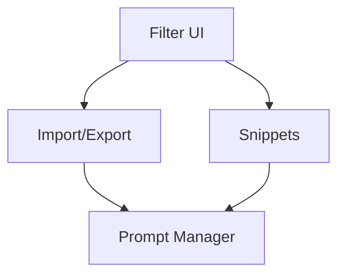

# ClaudeLens Implementation Priority List

## Based on QA Review and Analysis

*Generated: 2025-08-06*

---

## Executive Summary

Following comprehensive QA review of all mockups, this document outlines the recommended implementation priority for ClaudeLens features. Priorities are based on user value, technical complexity, and strategic importance.

---

## Priority Matrix

| Priority | Feature | Complexity | User Impact | Time Estimate |
|----------|---------|------------|-------------|---------------|
| **P0** | Filter UI Improvements | Medium | Very High | 2-3 weeks |
| **P1** | Import/Export Page | High | High | 3-4 weeks |
| **P2** | Conversation Snippets | Medium | High | 2-3 weeks |
| **P3** | Prompt Manager | High | Medium | 4-5 weeks |

---

## Phase 1: Core Functionality (Weeks 1-3)
### Filter UI Improvements 🎯

**Why First:**
- Immediate impact on all users
- Improves existing functionality
- Lower technical complexity
- Foundation for other features

**Implementation Steps:**
1. **Week 1**: Backend filter logic
   - Multi-select dropdown implementation
   - Date range filtering
   - Cost range calculations
   - Filter preset storage

2. **Week 2**: Frontend components
   - React components for filters
   - State management setup
   - API integration
   - Responsive design implementation

3. **Week 3**: Polish & Testing
   - Performance optimization
   - E2E testing
   - Accessibility audit
   - User acceptance testing

**Success Metrics:**
- Filter application time < 500ms
- Support for 10+ simultaneous filters
- Mobile responsiveness verified
- WCAG AA compliance achieved

---

## Phase 2: Data Portability (Weeks 4-7)
### Import/Export Functionality 📦

**Why Second:**
- Critical for data ownership
- Enables backup/restore
- Required for enterprise users
- Foundation for collaboration

**Implementation Steps:**
1. **Week 4**: Export Backend
   - Format converters (JSON, CSV, Markdown, PDF)
   - Batch processing system
   - Progress tracking
   - File compression

2. **Week 5**: Export Frontend
   - Export configuration UI
   - Progress indicators
   - Download management
   - Export history

3. **Week 6**: Import Backend
   - File validation
   - Data mapping
   - Conflict resolution
   - Import queue system

4. **Week 7**: Import Frontend
   - Drag-and-drop interface
   - Preview system
   - Mapping UI
   - Error handling

**Success Metrics:**
- Export 1000 conversations < 30 seconds
- Import validation accuracy > 99%
- Support files up to 100MB
- Zero data loss during import/export

---

## Phase 3: Knowledge Management (Weeks 8-10)
### Conversation Snippets 🔖

**Why Third:**
- Enhances power user experience
- Builds on existing conversation data
- Moderate complexity
- High engagement potential

**Implementation Steps:**
1. **Week 8**: Backend Infrastructure
   - Snippet data model
   - Selection algorithm
   - Storage optimization
   - Search indexing

2. **Week 9**: Core UI
   - Selection interface
   - Snippet cards
   - Collection management
   - Quick access panel

3. **Week 10**: Advanced Features
   - Sharing system
   - Annotations
   - Related snippets
   - Analytics dashboard

**Success Metrics:**
- Snippet creation < 2 seconds
- Search response < 200ms
- Support 1000+ snippets per user
- Share link generation instant

---

## Phase 4: Advanced Tools (Weeks 11-15)
### Prompt Manager 🎨

**Why Last:**
- Most complex feature
- Requires mature infrastructure
- Advanced user feature
- Can iterate based on earlier learnings

**Implementation Steps:**
1. **Week 11**: Data Architecture
   - Prompt storage system
   - Version control
   - Template engine
   - Variable system

2. **Week 12**: Organization System
   - Folder structure
   - Tagging system
   - Search infrastructure
   - Permission model

3. **Week 13**: Editor Interface
   - Code editor integration
   - Syntax highlighting
   - Auto-completion
   - Preview system

4. **Week 14**: Collaboration Features
   - Sharing mechanism
   - Team workspaces
   - Comment system
   - Fork/merge functionality

5. **Week 15**: Analytics & Testing
   - Usage tracking
   - Performance metrics
   - A/B testing framework
   - Playground environment

**Success Metrics:**
- Editor latency < 50ms
- Support 500+ prompts per user
- Version history unlimited
- Collaboration real-time

---

## Technical Dependencies

### Prerequisites for All Phases:
- [ ] Database schema updates
- [ ] API versioning strategy
- [ ] Authentication enhancements
- [ ] Storage infrastructure
- [ ] CDN setup for assets

### Cross-Feature Dependencies:

---

## Risk Mitigation

### Identified Risks:

1. **Performance at Scale**
   - Mitigation: Implement pagination and lazy loading
   - Monitoring: Set up performance metrics

2. **Data Migration**
   - Mitigation: Backwards compatibility layer
   - Testing: Staged rollout with beta users

3. **Mobile Complexity**
   - Mitigation: Progressive enhancement approach
   - Strategy: Desktop-first, mobile-optimized

4. **Feature Adoption**
   - Mitigation: In-app tutorials and guides
   - Measurement: Usage analytics from day 1

---

## Resource Requirements

### Team Allocation:

| Phase | Frontend | Backend | QA | Design |
|-------|----------|---------|----|---------|
| 1 | 2 devs | 1 dev | 1 | 0.5 |
| 2 | 1 dev | 2 devs | 1 | 0.5 |
| 3 | 2 devs | 1 dev | 1 | 0.5 |
| 4 | 2 devs | 2 devs | 2 | 1 |

### Infrastructure Needs:
- Additional database capacity for snippets/prompts
- CDN for export file delivery
- Background job processing for imports
- Redis for caching filter results

---

## Success Criteria

### Overall Project Success:
- [ ] All features deployed to production
- [ ] < 1% error rate in production
- [ ] 80% user adoption within 3 months
- [ ] Performance SLAs maintained
- [ ] Accessibility standards met

### Per-Feature Success:
- [ ] Filter UI: 90% of users apply at least one filter
- [ ] Import/Export: 50% of users export data monthly
- [ ] Snippets: 30% of users create snippets
- [ ] Prompt Manager: 20% of power users adopt

---

## Post-Launch Iterations

### Month 1 Post-Launch:
- Bug fixes and performance tuning
- User feedback incorporation
- Documentation updates

### Month 2 Post-Launch:
- Feature enhancements based on usage
- Additional format support
- API for third-party integrations

### Month 3 Post-Launch:
- Advanced analytics
- Machine learning recommendations
- Enterprise features

---

## Alternative Approaches

### If Resources Limited:

**Option A: MVP Approach**
- Phase 1: Filter UI (basic version)
- Phase 2: Simple Export (JSON only)
- Defer: Snippets and Prompt Manager

**Option B: Feature Flags**
- Deploy all features behind flags
- Gradual rollout to user segments
- A/B testing for adoption

**Option C: Plugin Architecture**
- Core features in main app
- Advanced features as plugins
- Community contribution model

---

## Conclusion

This implementation priority list provides a structured approach to delivering maximum value to ClaudeLens users while managing technical complexity and resource constraints. The phased approach allows for learning and adjustment between phases while maintaining momentum.

### Key Recommendations:
1. **Start with Filter UI** for immediate impact
2. **Prioritize data portability** for user trust
3. **Build knowledge management** progressively
4. **Save complex features** for last
5. **Maintain flexibility** to adjust based on feedback

### Next Steps:
1. Review with engineering team
2. Finalize resource allocation
3. Set up tracking metrics
4. Begin Phase 1 implementation
5. Schedule weekly progress reviews

---

*This document should be treated as a living guide and updated as implementation progresses and new insights emerge.*
